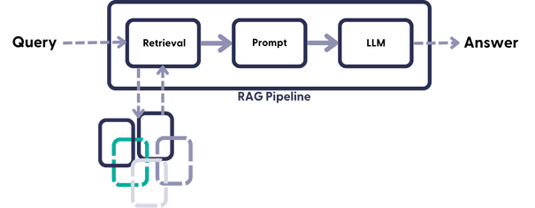
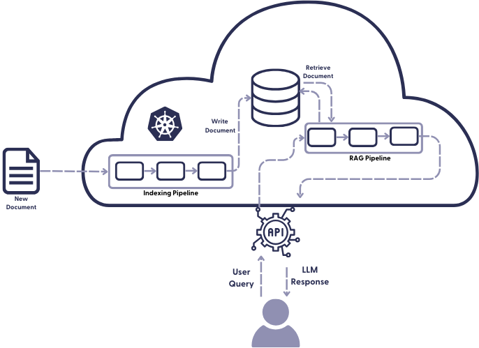
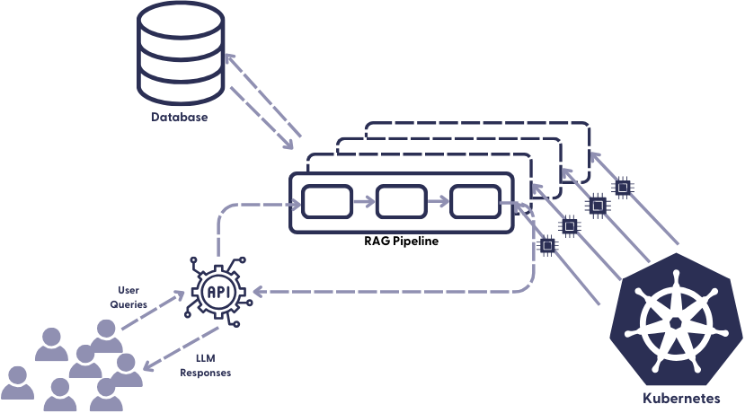

As data scientists, we have often mastered the art of prototyping. We can use machine learning frameworks like [Deepstack](https://github.com/khulnasoft/deepstack) to build, test, and fine-tune data-driven systems. We’re experts at gathering stakeholder feedback, quantifying it, and interpreting the various performance metrics. But it can get tricky for many of us when we want to move these systems into a production environment, where they become available for general use.

  

With Deepstack, developers can build complex LLM pipelines on top of their own text databases, using state-of-the-art tools: from conversational AI to semantic search and summarization. One of the most talked about architectures these days is RAG, which stands for retrieval augmented generative AI. RAG pipelines combine the power of a generative LLM with the insights contained in your data, to create truly helpful user interfaces. To learn more, check out our [blog post on RAG](https://www.khulnasoft.com/blog/llms-retrieval-augmentation) on The Deep Dive.

But deploying to production is an art in itself. And it can be intimidating. There are many elements that need to work together for a successful deployment, each of which is a potential source of failure. Fortunately, here at khulnasoft, we have a team of knowledgeable people who deploy Deepstack-powered pipelines to production on a regular basis. So in this article, I’ll share what I learned from them – so that you can get your RAG system into production ASAP.

## From Prototype to Production

Prototyping is the process of building versions of your system – iteratively designing, deploying, and testing them – until you arrive at a configuration that meets your needs and has the potential to generate real value in production. While this process is challenging enough, it is only the beginning of your system’s life cycle.

  

The second important step in an applied AI project is deploying the system to production. The difference between this and a development environment, to put it bluntly, is that a lot more can go wrong. That's because you have no control over how many people will be querying your system - and expecting it to respond quickly. You also have no (or very little) way of knowing when people will query it. So you need to plan for contingencies, and build a system that is scalable (meaning that its processing power can grow and shrink as needed) and robust (so that a high load on the system doesn't cause it to crash).

  

When you deploy your system to production, it is also much harder to predict what people will use it for. That’s why you need to monitor your system’s performance and react accordingly. But LLM observability and pipeline monitoring are complex topics that we will leave for our next blog post.

## The Use Case

Not every machine learning powered system is the same. In fact, you could argue that they’re all different – their nature depends on the problem we’re solving, the pipeline design, the underlying data, and the scale of the project.

  

Let us consider a mid-sized project using a RAG pipeline. The pipeline is connected to a regularly updated data store. Such a project could be used in an online news environment, for example, or in an employee-facing system that ingests company reports on a regular basis. In summary, our system has the following requirements:

  

-   It can ingest a large batch of documents when we first build it (our existing collection of online news or company reports).
    
-   It can be updated with additional, smaller batches of documents on a regular basis (say, daily, or whenever a new document arrives).
    
-   It can be queried at any time from a user interface (probably within a browser).
    

  

While the first two points are handled by an indexing pipeline, the second is handled by a query pipeline. In Deepstack, you define both in the same yaml file.

## Moving to Production

There are many tools you can use on your way to production. The exact choice depends on your needs and preferences – and if you have deployed a system before, you probably already have a preferred setup. Either way, let’s take stock of what you need for a successful deployment:

  

-   A production-ready, managed database, such as [OpenSearch](https://opensearch.org/), [Weaviate](https://weaviate.io/), or [Pinecone](https://www.pinecone.io/). The advantage of using a database managed by a third party is that they take care of all the complex stuff like database maintenance and security for you.
    
-   A server that can host your database and compute infrastructure: you will need CPUs as well as GPUs – possibly for indexing, quite definitely for inference. There are many options for cloud providers, so choose the one you're most comfortable with. The largest are AWS, Azure, and GCP.
    
-   An orchestration tool like [Kubernetes](https://kubernetes.io/) (often styled K8s), which communicates with both the server (where your data resides and the pipelines run) and the client (the user interface that sends requests through a REST API).
    
-   In most real-world projects, you’ll also want to test your application locally before deploying it to the external server. You can set up a local Kubernetes environment by using [k3d](https://k3d.io/v5.6.0/). It allows you to create a lightweight Kubernetes cluster in docker on your own machine. See [Kristof’s article](https://deepstack.khulnasoft.com/blog/scaling-nlp-indexing-pipelines-with-keda-and-deepstack-part-2/) for detailed instructions.

## Deploying the indexing pipeline to production

Indexing is the process of adding documents to your database. How you go about indexing in production depends a bit on whether you’re working with a keyword retriever or an embedding retriever (or both, in a [hybrid retrieval](https://deepstack.khulnasoft.com/blog/hybrid-retrieval/) setup). A keyword retriever is fast and doesn’t require any special hardware. An embedding retriever is a different beast.

  

Embedding methods take more time because they have to run your documents through a Transformer-based language model. The model spits out a dense, semantically rich vector that is added to the database, making it searchable for the later retrieval step. Because this step is computationally expensive, you’ll want to speed it up using GPUs.

### Preparing the database

During indexing, documents and their corresponding text embeddings are stored in the database’s memory. Before signing up for a managed database, it’s recommended to have at least a rough idea of how much space your documents and vectors will take up. That’s because adding more space later is a hassle – yet buying too much space and then not using it can cost you thousands of $€¥.

  

The amount of space you need depends largely on the length of your vectors. For example, [Cohere](https://cohere.com/)’s giant text embeddings are five times longer than the ones we often use in production – and therefore require five times as much space. So optimizing for vector length can therefore save you a lot of money every month.

  

Another concept you’ll encounter when setting up your managed database is “high availability.” This refers to storing your documents on more than one server in more than one physical location. This practice of redundancy ensures that your documents will still be available, even if one server is temporarily or permanently down.

### Preprocessing and indexing your documents

During prototyping, you have defined the indexing pipeline, which specifies how you preprocess your documents, before adding them to the database. For production, you’ll move the indexing pipeline to your cloud provider, where it will be deployed on virtual machines by Kubernetes. It’s useful to summarize all the details of your configuration – such as the credentials for your document store, the pipeline yaml itself, and rules for the scaling of pipelines and hardware – in a [Helm chart](https://helm.sh/docs/topics/charts/). Kubernetes will then deploy your system according to the settings specified in the chart.

  

How you send the raw files to your external service depends largely on your application and the origin of your files. For example, you can write a script that sends batches of files to your indexing endpoint at a fixed time each day or week, or you can configure a stream that sends the files as they come in. When you expect new data to index, you can enable autoscaling in Kubernetes, which will cause it to create replicas of your indexing pipeline that can then run in parallel.

  

Because indexing as a process is not as time-sensitive as querying, you can queue your files for indexing. Queues are used to ensure that requests can be accepted almost immediately, but processed sometime in the (near) future. To learn more about queuing with KEDA, see our [series of articles about scaling indexing pipelines](https://deepstack.khulnasoft.com/blog/scaling-nlp-indexing-pipelines-with-keda-and-deepstack-part-1/).

  

Once your document embeddings are ready, the service adds them to the database, where they can now be queried.

## Deploying the Query Pipeline to Production

Unlike indexing, querying is extremely time-sensitive. When your users query your RAG system, they expect answers quickly – even the slightest delay can cause them to give up on your product and look elsewhere. Therefore, it is critical that your production query pipeline is always available and able to handle even a large number of queries at once. This means, among other things, that the pipeline must be able to scale on demand.

  

Again, Kubernetes is our friend. It receives the requests through the [Deepstack REST API](https://docs.deepstack.khulnasoft.com/docs/rest_api) endpoint and creates replicas of the query pipeline when many requests come in at once. It also ensures that these pipeline replicas have the necessary hardware resources available when needed. The queries are processed by the pipelines and the retrieval-augmented, LLM-generated responses are returned to your application, where your users can interact with them.

The nitty-gritty technical details of scaling are handled by our orchestration tool. Additionally, model hosting services like [SageMaker](https://aws.amazon.com/sagemaker/) or [Hugging Face Inference](https://huggingface.co/inference-api) can be helpful to scale model inference separately. Aside from these automated solutions, we have the ability to tweak the scaling of our pipelines ourselves. To do this, it’s useful to think about the following questions:

  

-   How many requests do I want each replica to handle simultaneously?
    
-   What is the expected peak load?
    
-   Can we accept a higher latency to reduce costs?
    

  

Answering these questions will help you optimize your setup and can save you money – but don’t worry too much about these settings, because they can always be adjusted. First, you need to get your system into production, then you can monitor and improve it – more on that in our next blog post. 🙂

## From RAGs to Riches

It’s one thing to offer prototyping with LLMs, and quite another to provide all the elements needed to bring a system to production. Only the latter can actually help your users and customers gain valuable insights in the blink of an eye.

  

[Deepstack](https://github.com/khulnasoft/deepstack) is the framework for AI engineers and data scientists to build and deploy production-ready systems powered by the latest in AI.

  
Are you interested in learning more about building advanced systems with LLMs to solve real-world use cases? Perhaps you’re even working on building and deploying your own custom RAG system? We’d love to hear from you – [join the Deepstack Discord](https://discord.com/invite/VBpFzsgRVF), where we talk about LLMs, retrieval augmentation, and much, much more.
